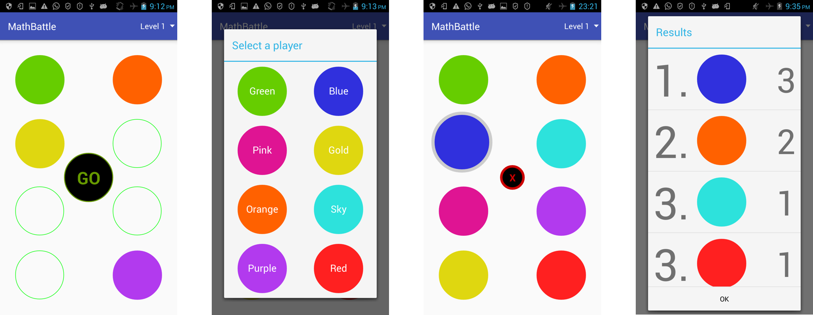

# MathBattle
MathBattle is a multiplayer math quizzer for Android, using voice recognition &amp; text-to-speech. It is dependent on <a href="https://github.com/myieye/MathBattleServer">MathBattleServer</a>.

MathBattle was developed over the course of two class during my Master's degree. It demonstrates the rise of effective voice rocognition, a key component of _ubiquitous computing_ and the Internet of Things.

MathBattle fully supports both English and German.

## Demo

